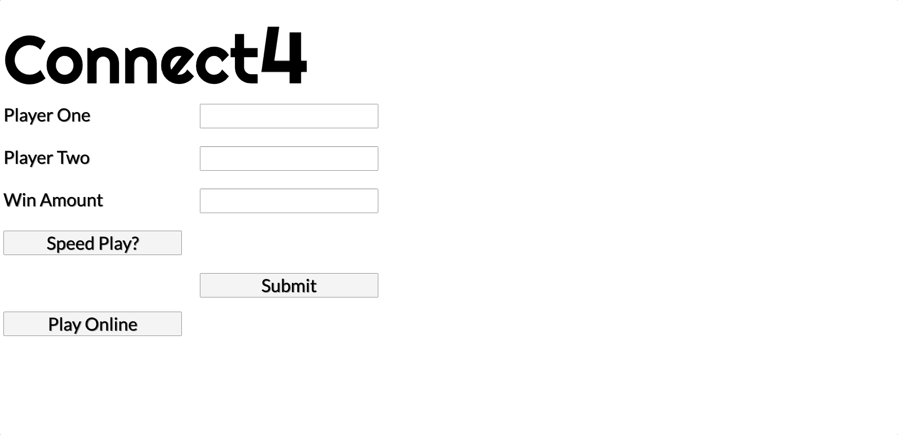

# Connect-Four-or-More

[Live Version](https://connect-four-or-more.herokuapp.com/)


---

## About Game

A multiplayer connect4 game playable locally and online.  Players have the option to choose how many chips-in-a-row are needed to win (from three to six). Players can also opt to play speed-connect4 (same rules as speed chess) and they decide how many total seconds each player has. 


---

## Tech-Stack
- [React](https://reactjs.org/)
- [Redux](https://redux.js.org/)
- [TypeScript](https://www.typescriptlang.org/)
- [socket.io](https://socket.io/)
- [Node.js](nodejs.org)
- [Express](http://expressjs.com/)
- [Sass](https://sass-lang.com/)

---

## Getting Started
>*Install dependencies*
```
npm install
```
>*Webpack*
```
npm run build-prod
```
>*Start the server*
```
npm start
```
Open `http://localhost:8080` in your browser


The game is also playable online at `https://connect-four-or-more.herokuapp.com/`

---


## Local Play

For local play enter each player's name on the main screen and choose the win amount.  The win amount is how many chips in a row are needed to win. You may choose between 3 and 6 chips.

If you wish you may choose to play a speed version of the game.  Click the "Speed Play?" button and enter the amount of seconds each player will have to win.  Each player will start with the same amount of time chosen.  Player one's clock will start once the "Start Speed Play" button is clicked and it will continue running until the player makes a play and player two's clock will start.  Running out of time is an automatic loss.

To make a play when it is your turn click any circle within the column that you want to drop a piece.

To reset the board after a player wins or mid play, click the "Reset Board" button.  

To change which player is starts a game, click "Change Turns", but this is only available at the beginning of a game.

To return to the main page to re-enter names or change the game rules click "Reset Rules".


---

## Online Play

To start a game online click "Play Online" from the main page.  One player must first create a game by clicking "Create Game", enter their name (and choose the rules just as with local play), and click "Submit".  The player will be given a game code which they will need to communicate to the second player.  The second player needs to click "Play Online" from the main page and then click "Join Game".  Enter your name and the game code, click submit, and you will join the game.

The rules of the game are the same as local play.  The sole change is that resetting the board mid-game requires both players clicking "Reset Board". When one player clicks "Reset Board" the second player will see a prompt on this button telling them that the first player has requested a reset.



---


